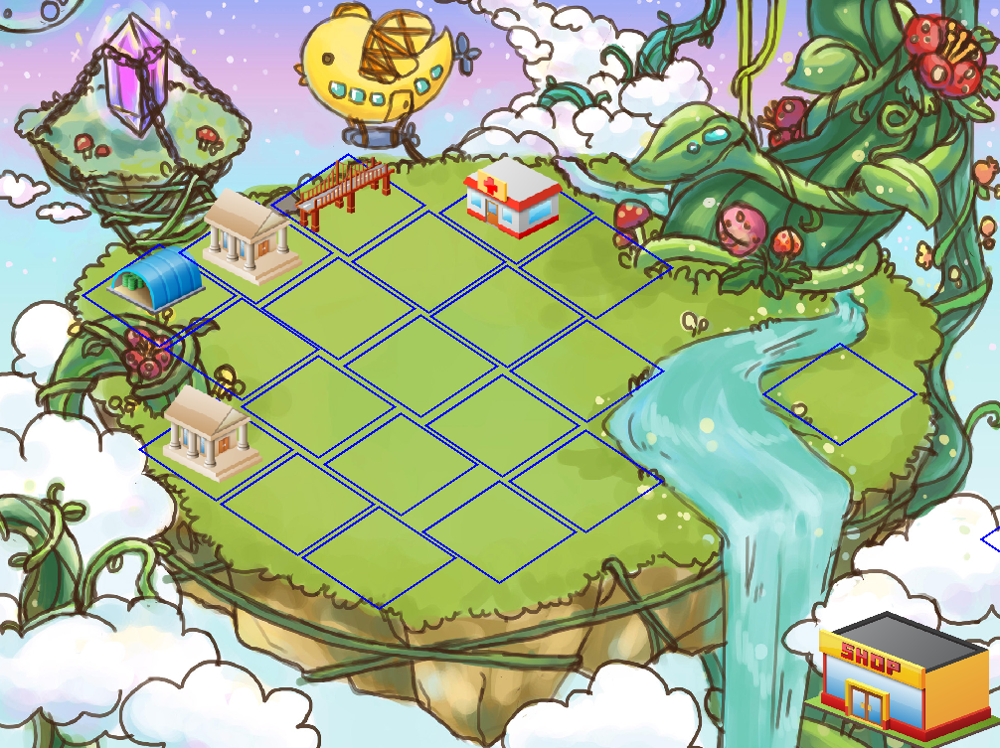

# CastleBuilder

Is a game which has implemented in C++. SFML Framework used to rendering and input handling and Cereal used for serialization.
Game config, maps, shop data and all the other stuff in the is completely serializable to xml.

In Game Screenshot

